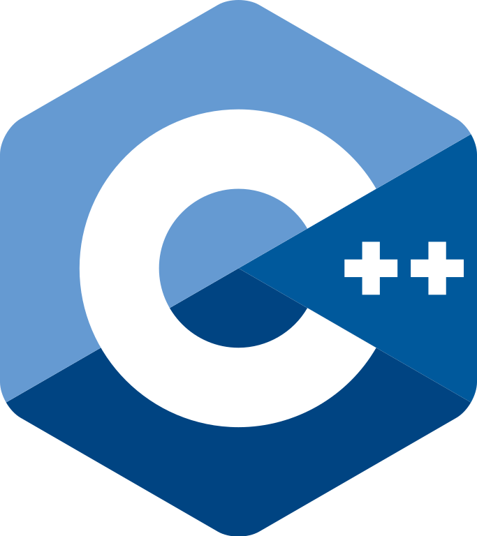

# Two Pointers in 

## Blind 75 (🧑‍🦯7️⃣5️⃣)
- [ ] Valid Palindrome · easy 🟢  
- [ ] 3Sum · medium 🟠
- [ ] Container With Most Water · medium 🟠

## NC 150

- [ ] Two Sum II Input Array Is Sorted · medium 🟠
- [ ] Trapping Rain Water · hard 🔴