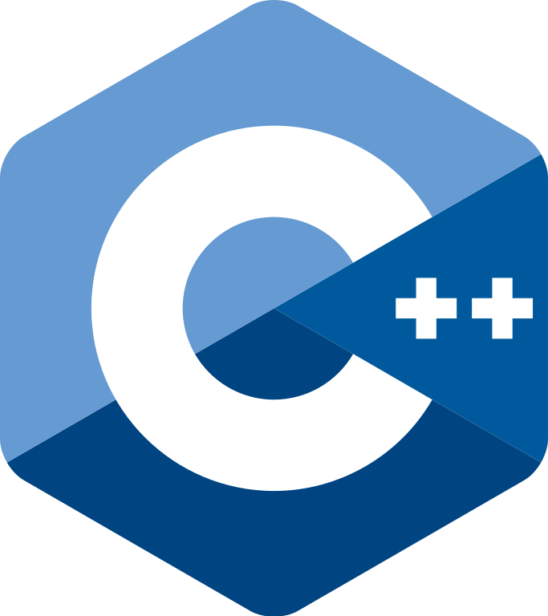
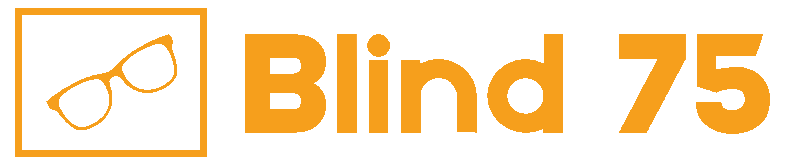

# All Problems

### Supported Languages

- [Python ](https://github.com/flenhu/leetcode/tree/main/Python)
- [JavaScript ](https://github.com/flenhu/leetcode/tree/main/JavaScript)
- [Java ](https://github.com/flenhu/leetcode/tree/main/Java)
- [C++ ](https://github.com/flenhu/leetcode/tree/main/Cpp)
- [TypeScript ](https://github.com/flenhu/leetcode/tree/main/TypeScript)
- [Swift](https://github.com/flenhu/leetcode/tree/main/Swift)
- [Go ](https://github.com/flenhu/leetcode/tree/main/Go)

## Arrays & Hashing

- [Contains Duplicate](https://leetcode.com/problems/contains-duplicate/)
  | easy 🟢 |‎ 
  | 
  | 
  | 
  | 

- [Valid Anagram](https://leetcode.com/problems/valid-anagram/)
  | easy 🟢
  | 
  | 

- [Concatenation of Array](https://leetcode.com/problems/concatenation-of-array/)
  | easy 🟢
  | 

- [Two Sum](https://leetcode.com/problems/two-sum/)
  | easy 🟢
  | 
  | 

- [Remove Element](https://leetcode.com/problems/remove-element/)
  | easy 🟢
  | 

## Two Pointers

- [Valid Palindrome](https://leetcode.com/problems/valid-palindrome/)
  | easy🟢
  | 
  | 

- [Remove Duplicates From Sorted Array](https://leetcode.com/problems/remove-duplicates-from-sorted-array/)
  | easy🟢
  | 

## Sliding Window

- [Best Time to Buy And Sell Stock](https://leetcode.com/problems/best-time-to-buy-and-sell-stock/)
  | easy🟢
  | 
  | 

## Stack

- [Valid Parentheses](https://leetcode.com/problems/valid-parentheses/)
  | easy 🟢
  | 
  | 

## Binary Search

- [Binary Search](https://leetcode.com/problems/binary-search/)
  | easy 🟢
  | 

## Linked List

- [Reverse Linked List](https://leetcode.com/problems/reverse-linked-list/)
  | easy 🟢
  | 
  | 

- [Merge Two Sorted Lists](https://leetcode.com/problems/merge-two-sorted-lists/description/)
  | easy 🟢 
  | 
  | 

## Trees
- [Invert Binary Tree](https://leetcode.com/problems/invert-binary-tree/description/)
  | easy 🟢 
  | 
  | 
## Tries

## Heap & Priority Queue
- [Kth Largest Element in a Stream](https://leetcode.com/problems/kth-largest-element-in-a-stream/description/)
  | easy 🟢 
  | 
  | 

## Backtracking

## Graphs

## Advanced Graphs

## 1-D Dynamic Programming
- [Climbing Stairs](https://leetcode.com/problems/climbing-stairs/description/)
  | easy 🟢 
  | 
  | 

## 2-D Dynamic Programming

## Greedy

## Intervals

## Math & Geometry

## Bit Manipulation
- [Number of 1 Bits](https://leetcode.com/problems/number-of-1-bits/description/)
  | easy 🟢 
  | 
  | 

- [Counting Bits](https://leetcode.com/problems/counting-bits/description/)
  | easy 🟢 
  | 
  | 